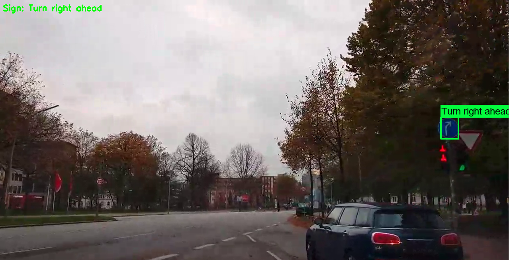
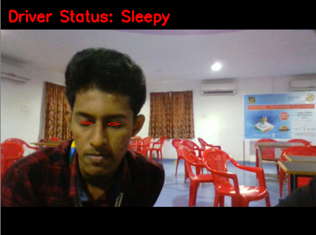

# Pyxel AI

A complete Warning System for Drivers using Artificial Intelligence and Computer Vision.

## Project Description

Project developed based on a problem statement given by **ARAI (Automotive Research Association of India)** for **Smart India Hackathon 2020 - Software Edition.**

**Pyxel-AI** can promote accident prevention and guide the user to stay on safetrack **ensuring personal as well as pedestrian safety**.

We have developed a software as well as hardware component that can be used as a supplement in any existing vehicle, which would detect **traffic signs, traffic lights, driver’s drowsiness, sudden lane changes, predict pedestrian movement, zonal analysis (school zones and other emergency zones) of speed data** that collectively forms our **warning system**. 

The product is powered by **AI (Deep Learning and Reinforcement Learning)** & **Computer Vision**, uses **IoT** for hardware and the software can run on smartphones as well as computers of any platform and configuration.

## Snapshots

We have only included the snapshots from our product in this page. The following are some sample snapshots of three modules from our project. 

### Traffic Sign, Signals Detection & Recognition

* Detects and recognizes traffic signs (39 classes of Indian Traffic Signs for now) and traffic signals in real-time.
* Displays reminder for traffic signs that have most priority and warns when traffic signs are not followed.
* Also detects school zones and emergency zones based on signs as well as GPS location (within 500m radius)  and warns accordingly if not in recommended speed  limit.

### Lane Change Detection

* Specifically developed for Indian roads to detect when a vehicle goes out of lane even if lanes are not visible.

### Driver Drowsiness Detection

* Continuously monitors the driver’s status and warns when the driver goes into sleep or feels sleepy (based on eye blink rate and eyelid status).  Our model works during night time too.

## Working and Usecase

### Flowchart

The warning system consists of 3 sub-systems:

* Computer Vision System (Traffic Sign, Signals Detection & Recognition, Pedestrain Movement Prediction, Driver Drowsiness Detection, & Lane Change Detection and Warning)
* Location and Vehicle Data Grabbing System (Location using phone's GPS or using GPRS sensor, Vehicle data such as speed, fuel consumption, etc using OBD2 sensors)
* Data Analysis and Warning System (Analyses the above system's data and decides to give warning to the user if needed).

### Use Case 

The following diagram is the use case diagram of our product:

## About

This product was developed by Team Rogue Daemons

### Team Members

* Akshay Kumaar M
* Sanjay Krishnaan H
* Nikhil Xavier John
* Maria Vinita C
* Shree Kriti R
* Varsha C